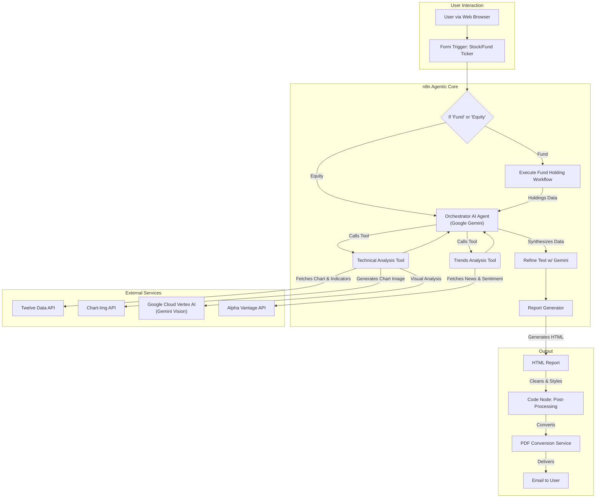
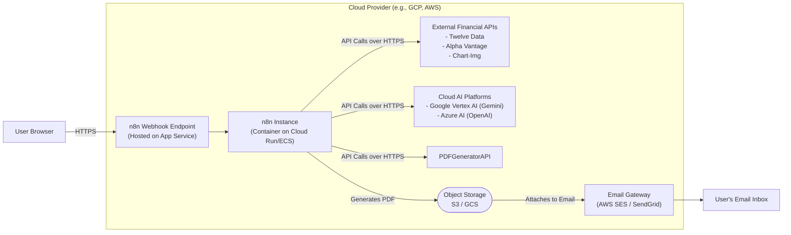
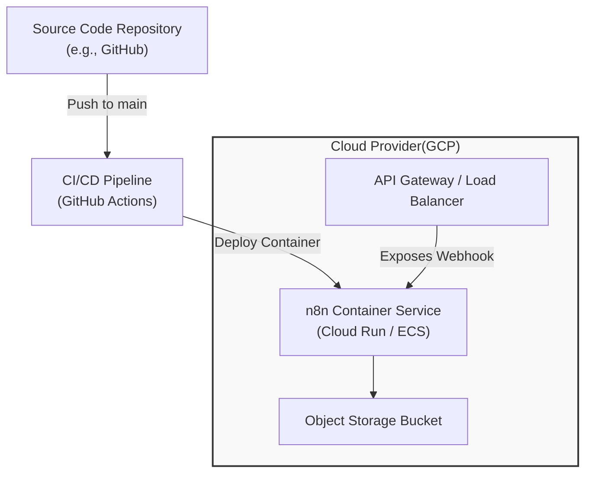
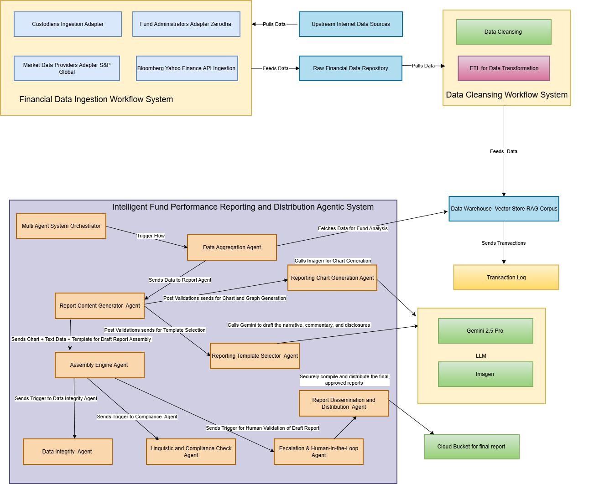
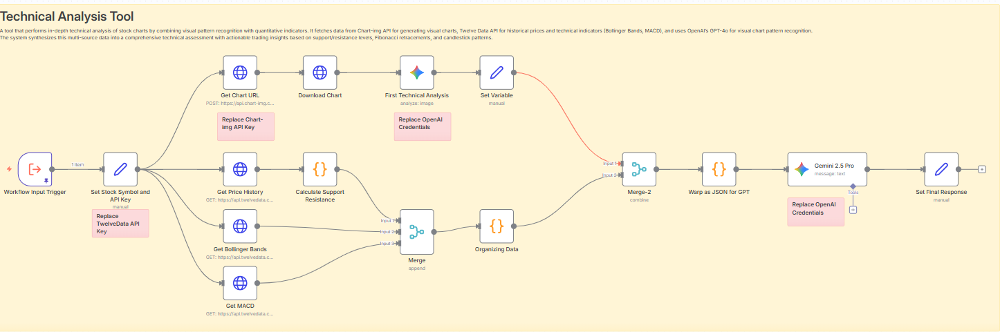
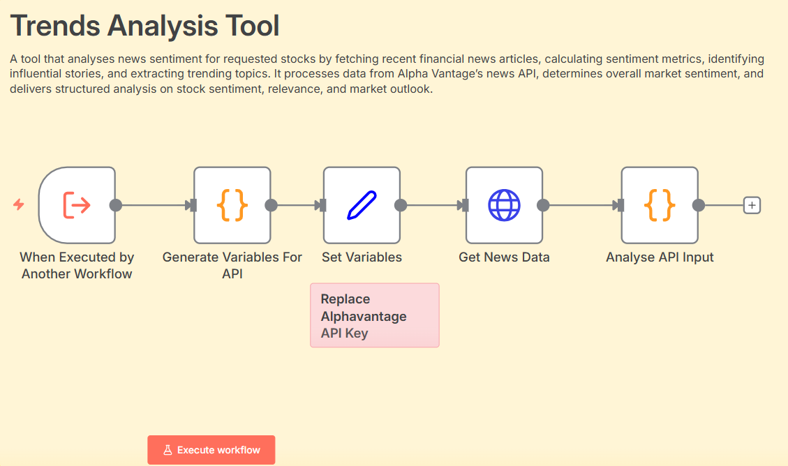
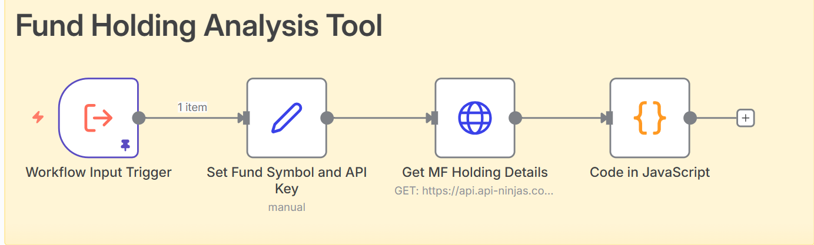

ance# Intelligent Fund Reporting - Architecture Overview

## 1. Introduction

This document describes the architectural design for the **Intelligent Fund Reporting** project. The system is an agentic workflow built on the n8n.io platform on AWS, designed to perform automated stock and fund analysis. It combines technical analysis from chart data and quantitative indicators with sentiment analysis from financial news. The final output is a comprehensive, human-readable report delivered as a PDF. This document outlines the logical, physical, and deployment architectures, highlighting all major components and their interactions.

---

## 2. Logical Architecture

The logical architecture represents the conceptual flow and the roles of each component within the n8n workflow. The system is designed as a primary AI agent that delegates specialized tasks to dedicated sub-workflows (tools).

-   **Form Trigger:** The user initiates the flow via a public n8n web form, providing a ticker symbol and entity type (Equity/Fund).
-   **Orchestrator AI Agent (Google Gemini):** This is the central brain of the operation (`AI Agent` node). It receives the ticker, decides which tools to call (`technical_analysis`, `trends_analysis`), and synthesizes their outputs into a structured JSON report based on a detailed system prompt.
-   **Technical Analysis Tool (Sub-Workflow):** A dedicated LangChain tool that:
    1.  Fetches historical price data, Bollinger Bands, and MACD from the **Twelve Data API**.
    2.  Generates a chart image using the **Chart-Img API**.
    3.  Performs visual analysis on the chart image using **Google Gemini Vision**.
    4.  Calculates support, resistance, and Fibonacci levels using custom code.
    5.  Merges all technical data and returns a structured JSON object.
-   **Trends Analysis Tool (Sub-Workflow):** A dedicated LangChain tool that:
    1.  Fetches news and sentiment data from the **Alpha Vantage API**.
    2.  Uses custom code to analyze sentiment distribution, identify top articles, and extract hot topics.
-   **Report Generator:** A series of nodes that take the final JSON from the AI Agent, populate an HTML template, dynamically adjust colors based on sentiment, and convert the final HTML into a PDF using the **PDFGeneratorAPI**.
-   **External Services:** The system relies on several third-party APIs for data and intelligence.

---

## 3. Physical Architecture

The physical architecture describes how these logical components are hosted and interact in a cloud environment. The core is the n8n instance, which acts as the central compute and orchestration engine.

-   **n8n Webhook Endpoint:** A public URL provided by the n8n instance, which receives the form submission.
-   **n8n Instance (Compute):** This is the core application, running as a containerized service (e.g., on Google Cloud Run, AWS ECS, or a dedicated VM). It executes the entire workflow logic defined in the JSON.
-   **Cloud AI Platforms:** The n8n instance makes secure API calls to Google Cloud and Azure for their respective AI model capabilities (text generation, vision analysis).
-   **External Financial APIs:** The n8n instance communicates directly with third-party data providers over the internet via REST APIs.
-   **Object Storage:** A cloud storage service (like AWS S3 or Google Cloud Storage) is used to temporarily store the generated PDF report before it's attached to an email.
-   **Email Gateway:** A managed email service (like AWS SES or SendGrid) is used to reliably send the final report to the user.

---

## 4. Deployment Architecture

This diagram shows how the system is deployed and maintained.

-   **CI/CD Pipeline (GitHub Actions):** Automates the process. When changes are pushed to the repository (e.g., an updated n8n workflow JSON), the pipeline triggers. It can build a new Docker image containing the n8n instance and the latest workflow configuration.
-   **Cloud Provider:** The target deployment environment (e.g., Google Cloud).
-   **n8n Container Service:** The pipeline deploys the new container image to a managed compute service like Google Cloud Run or AWS ECS, ensuring minimal downtime.
-   **API Gateway:** An API Gateway is placed in front of the n8n webhook for added security, rate limiting, and custom domain mapping.

---

## 5. Conceptual Agentic Architecture 

Below is the Complete Agentic Architecture with complete integration with a robust Data Ingestion and Transformation Pipeline deployed on GCP Cloud we are proposing. The currently developed prototype with N8N will be transformed into a complete E2E flow on GCP cloud for serving at scale. Due to the unavailability of some features like SMTP Gateway on cloud, we focussed to deliver the key features around fund analysis and mentioned the additional ones which can be developed once the full fledged development is undertaken. 

## 6. Workflow Components (N8N)

| Component | Digram | Purpose |
|---|---|---|
| **Main Agent (Chief Investment Officer)** |   | **Core workflow orchestration and execution.** |
| **Technical Analysis Workflow Agentic Tool** |   | **Technical Analysis of Stocks/Funds.** |
| **Trend Analysis Workflow Agentic Tool** |   | **Trend Analysis of Stocks/Funds collating News from multiple financial websites.** |
| **Fund Analysis Workflow Agentic Tool** |   | **Stock Components Analysis of ETFs/Funds.** |

---

## 7. Cloud Components Used / Planned

| Component | Cloud Provider/Service | Purpose |
|---|---|---|
| **App Compute** | n8n Cloud, AWS ECS, GCP Cloud Run | **Core workflow orchestration and execution.** |
| **AI/ML Service** | Google Cloud Vertex AI | **Primary intelligence (Gemini Pro for text, vision analysis).** |
| **AI/ML Service** | Azure AI Services | **Secondary/alternative language model (GPT-4.1).** |
| **External APIs** | Alpha Vantage, Twelve Data, Chart-Img | **Sourcing raw financial news and technical data.** |
| **PDF Generation**| PDFGeneratorAPI | **Converting final HTML report to PDF.** |
| **Object Storage**| AWS S3, Azure Blob, Google Cloud Storage | **Storing the final PDF report before delivery.** |
| **Networking** | API Gateway / Load Balancer | **Securely exposing the n8n form trigger webhook.** |
| **Email Delivery**| AWS SES, SendGrid, or integrated SMTP | **Sending the final report to the user's email.** |
| **Monitoring** | AWS CloudWatch, GCP Cloud Logging | **Observability, logging workflow executions, and error tracking.** |
| **Agent Evaluations** | DEP Devals Library | **Data Integrtity Quality of Generation and Grounding checks.** |

---

## 8. Additional Notes

-   **Stateless Compute:** The n8n workflow is largely stateless for each run, making it ideal for serverless compute platforms like Cloud Run or Fargate. State (memory) is managed per-session by the `Window Buffer Memory` node.
-   **Security:** API keys and credentials for external services are managed securely within the n8n credentials store. All external communication is over HTTPS.
-   **Modularity:** The use of sub-workflows for `Technical Analysis` and `Trends Analysis` makes the system highly modular. Each tool can be updated or replaced independently without affecting the main orchestration logic.
-   **Data Transformation:** A significant amount of logic is handled within n8n `Code` nodes (JavaScript) for parsing API responses, performing calculations, and post-processing the final HTML report.

---

## 9. Diagrams

> The Mermaid diagrams above provide a detailed representation of the system's architecture based on the provided n8n JSON file.

---

## 10. Contact

For architectural questions or suggestions, contact: **Team Endurance** - subhodeep.sn@gmail.com.

