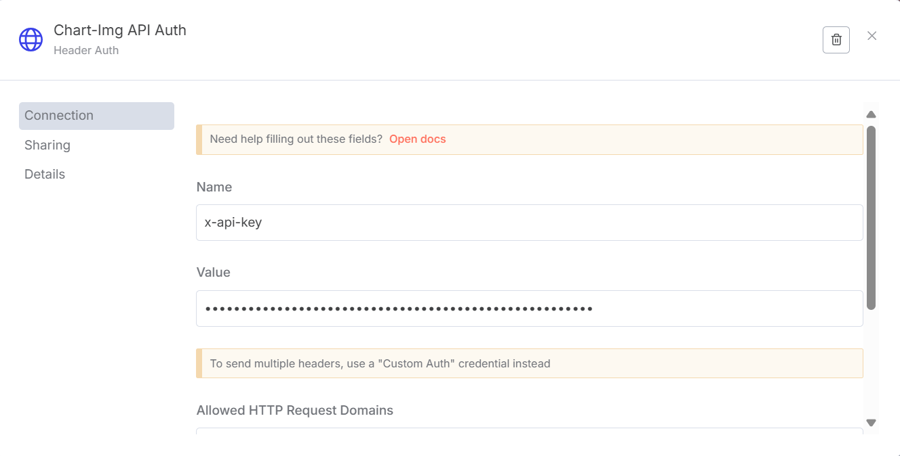
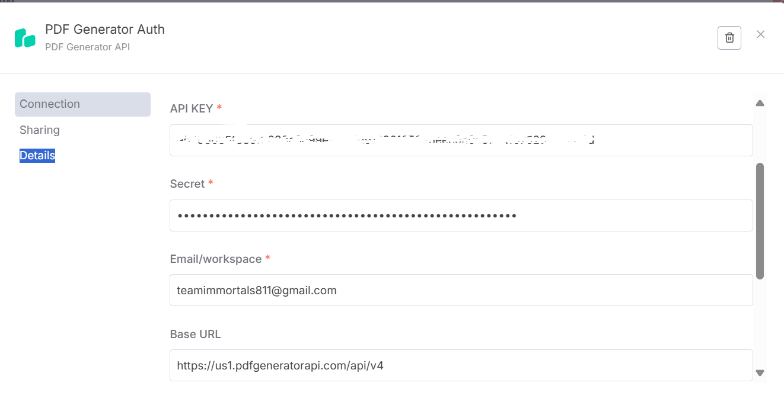
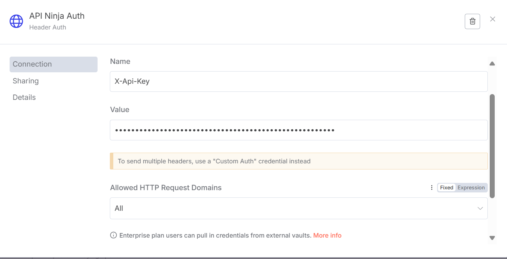
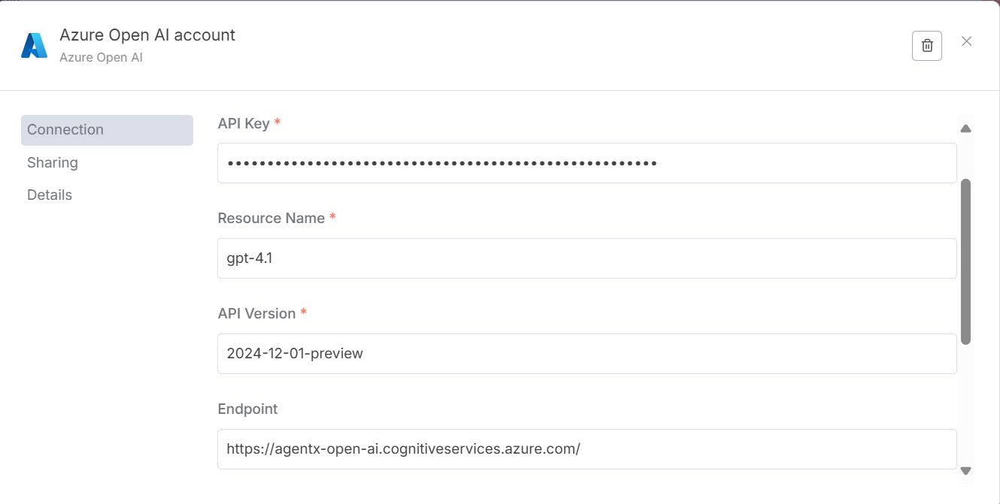
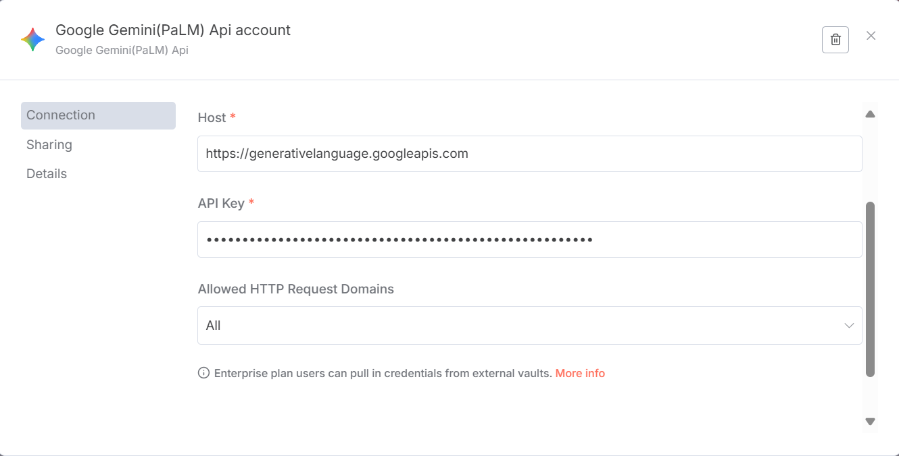
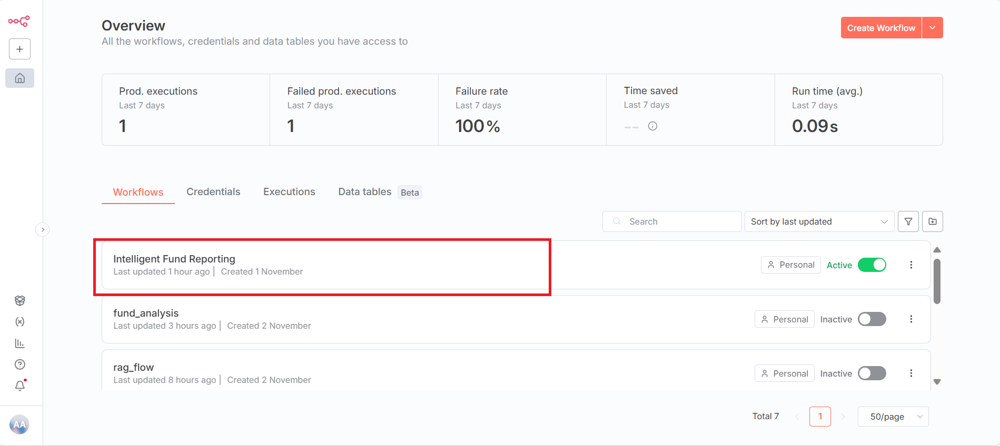
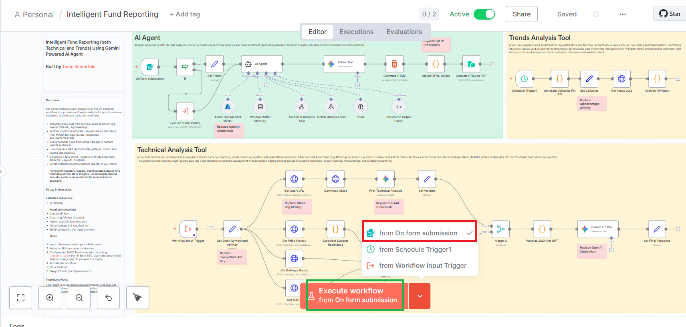
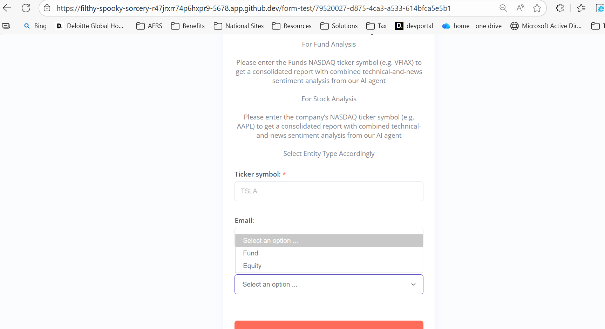

# AI for Bharat Hackathon

## Product Name
Intelligent Fund Performance Reporting and Distribution Multi Agentic System 

## Team Name
Team Endurance

---

## About the Project

Intelligent Fund Performance Reporting and Distribution is Multi Agentic System with the end goal to have following feature functionality 

Build an AI solution to gather portfolio and market data required for the content of fund performance reports from multiple sources, including custodians, fund administrators, market data providers, and internal trading platforms.

Structure the data into a defined format aligned with regulatory standards and client mandates. Draft thereport based on pre-defined investment guidelines, performance measurement methodologies (such as time-weighted or money-weighted returns), and compliance requirements.

Once ready, perform a comprehensive quality check of all data elements—such as NAV calculations, benchmark comparisons, attribution analysis—as well as format, language, and disclosure statements present in the report.

In case of any discrepancies or data integrity issues, escalate to respective teams (e.g., portfolio managers, compliance officers, or data stewards) following established communication and escalation protocols.

Report Dissemination: The AI model will be responsible for retrieving finalized fund performance reports,investor statements, or regulatory filings from designated repositories. It will compile the email body for report distribution, ensuring inclusion of relevant market commentary, risk disclosures, and required attachments (such as fact sheets, holdings reports, or transaction summaries).

The system will perform daily checks during email generation for clients—verifying which report is to be sent, timing aligned with market close or reporting cycles, recipient lists (institutional investors, asset owners, regulators), and number of attachments.

After all quality controls on the email and attachments are completed, the reports will be securely distributed to clients and stakeholders, maintaining audit trails for regulatory compliance. End users: Fund administrators, Asset managers, Operations and data management team

---

## Getting Started (Steps Involved to getting started with project)

### Prerequisites

- GCP Gemini 2.5 Pro and Imagen LLM
- Azure Open AI GPT 4.1 (Better to have o3/GPT 5) LLM
- N8N LCNC Agent Development Platform
- OS: Github Codespace Linux

### Steps to Run the Project

1. **Clone the repository:**
   ```bash
   git clone https://github.com/subhodeep/ai4bharat-intelligent-fund-reporting
   cd n8n-templates
   ```

2. **Install dependencies:**
   ```
    N8N is LCNC Agent Development Platform so seperate dependency installation not required
   ```

3. **Configure environment:**
   - **n8n-templates folder contain the template files which are to be imported in the n8n LCNC platform. Also provided same under aef-samples/n8n directory replacing the samples**
   - **fund-reports folder contains reports created for some companies like Amazon Microsoft Apple with the Agentic Flow**
   - **Also Provided Sticky Notes in the Templates for each of the Components**
   - Intelligent Fund Reporting.json (Main Template)
   - technical_analysis.json  (helper template)
   - trend_analysis.json  (helper template)
   - fund_analysis.json  (helper template)
   - Run the Codespace. When Codespace is completey up n8n platform should be up on port 5678
   - Login the n8n Platform GUI
   - Create the following N8N Credentials 
     1. Chart-Img API Key https://chart-img.com/
     
     2. PDF Generator API Key https://pdfgeneratorapi.com/
     	
	 3. API Ninja API Key https://api-ninjas.com/api
     	
	 4. Azure Open AI API Key https://agentx-open-ai.cognitiveservices.azure.com/
     	
	 5. GCP Gemini API Key https://generativelanguage.googleapis.com
     	
	 
	 Two More APIs Alpha Vantage https://www.alphavantage.co/documentation/#time-series-data and 
	 Twelve Data https://twelvedata.com/ are also used in the Agentic Flow but the credentials for those are supplied within the templates as those have Native Support in N8N Platform. 
     	 

4. **Run the project:**
    - Post Login the n8n Platform GUI and configuring the Credentials in N8N Import the templates   
	  (mentioned above) and save as workflows.
	- Install the PDF Generator Plugin in N8N LCNC Platform (Details Provided Above)
	- Go To the Intelligent Fund Reporting (Main Template) 
	  
	- Run the Execute Flow from Form Option 
	  

5. **Open in browser:**
   - If you are running in Codespace, in another Tab Visit http://{{ codespace host 
     url }}/form-test/79520027-d875-4ca3-a533-614bfca5e5b1 to view the Trigger Form. 
	 
	 
	 Provide the details as mentioned in the Form and click Submit

(Any further details related should be added here)

---

## Constraints

- Ensure all dependencies are met.
- Requires internet connectivity for API integrations.
- Local environment should not have any conflicting services running on port 5678.


---

## Tech Stack

- GCP Gemini 2.5 Pro and Imagen LLM 
- Azure Open AI GPT 4.1 (Better to have o3/GPT 5) LLM
- N8N LCNC Agent Development Platform
- OS: Github Codespace Linux

---

# Demo Folder  

---

## Contributors

- Subhodeep Sen


---

## License

The data used is from API Sources and licensed under - MIT and other Public Licenses. 

---

## Contact

For any queries or support, reach out to subhodeep.sn@gmail.com.

